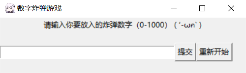

## 数字炸弹游戏(Number_Bomb)
###1、需求分析
&emsp;&emsp;**放假和朋友在家里一起玩时，有时会玩数字炸弹的游戏（从1——1000的数字中选择一个数字，后面的人每轮答一个数字，但是要避开），原本都是用手机计算器选择一个数字，然后还需要自己报大了小了，十分不方便，于是便设计了一个程序来帮助实现这个游戏的流程。**

&emsp;&emsp;**ps:****数字炸弹，即反向猜数字，由一个人设置一个数字作为炸弹，接下来猜的人要从一个范围内避开这个数字，并且范围会由上一个猜的人的大小进行缩小。**
###2、实现方法
&emsp;&emsp;**语言选择：python3.7**

&emsp;&emsp;**外加库：tkinter**

&emsp;&emsp;**设计思路：主要在提交按钮函数中进行炸弹数字的判断并计数，并且要进行错误输入的判断，比如输入不是数字而是中文，输入越界等，踩中炸弹由一个函数进行结果汇报，包括进行的轮次等，然后进行按键布局以及绑定按键功能，并最后在game函数中实现，在__main__函数中循环运行。**

###3、页面展示
